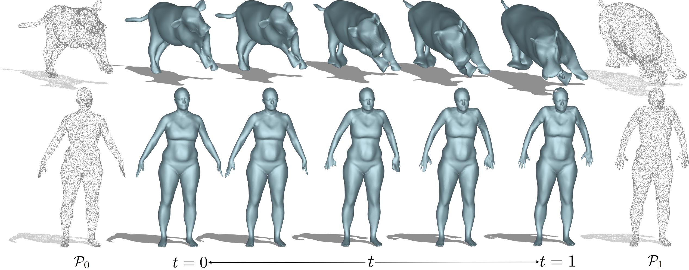
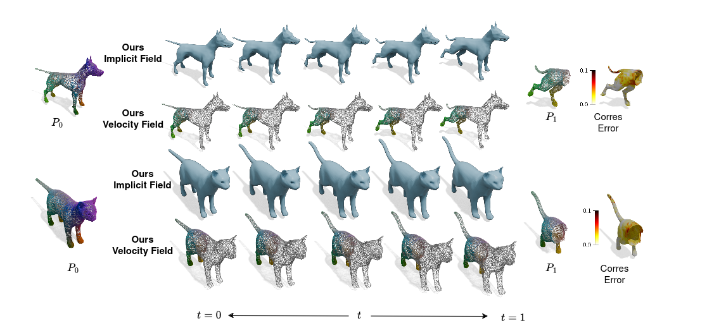

# Implicit Neural Surface Deformation with Explicit Velocity Fields

[Lu Sang](https://sangluisme.github.io/), [Zehranaz Canfes](), [Dongliang Cao](https://dongliangcao.github.io/), [Florian Bernard](https://scholar.google.com/citations?user=9GrQ2KYAAAAJ&hl=en), [Daniel Cremers](https://scholar.google.com/citations?user=cXQciMEAAAAJ&hl=en)

Technical University of Munich, Munich Center for Machine Learning, 
University of Bonn

[📄 PAPER]() 





<!--  -->

##  🖊️ Intro

In this repo, we offer official code for the paper 

- [**Implicit Neural Surface Deformation with Explicit Velocity Fields**]()

and re-implementation of 3D LipMLP

- [**Learning Smooth Neural Functions via Lipschitz Regularization**](https://github.com/ml-for-gp/jaxgptoolbox/tree/main/demos/lipschitz_mlp)


## 🛠️ Setup

install the package using
```
pip install -r requirements.txt
```
Please test if the `jax` successfully with `cudnn`. 

## 📏 Data Preparation

We offer 3 different dataset:

- ### Temporal Sequence Data, such as [**4D-DRESS**](https://eth-ait.github.io/4d-dress/)

Please download the dataset from the website and get the folder has structure such as:

    |--- _4D-DRESS_00135_Outer_2
        |--Take19
            |--Capture
            |--Meshes_pkl
            |--Semantic
            |--SMPL
            ....

then run 
```
python ./datasets/preprocessing.py --data_root <TO YOUR DATA FOLDER> --seq_num <YOUR SEQUENCE NUMER> --save_dir ./data/ --data_type temporal
```
for example
```
python ./datasets/preprocessing.py --data_root ./_4D-DRESS_00135_Outer_2 --seq_num 19 --save_dir ./data/ --data_type temporal
```

It will create a `Take19` folder under `data` folder, containing
    
    |-Take19
        |--mesh
        |--ptc
        |--smpl
        |--train

- ### Shape matching data where the correspondences are obtained from method [**Unsupervised Learning of Robust Spectral Shape Matching**](https://github.com/dongliangcao/unsupervised-learning-of-robust-spectral-shape-matching)

Please download the example [data](https://drive.google.com/file/d/1BCv3Jr1DIDxg6qiiaF4kZSj_wioEjd-e/view?usp=sharing) and extract it. We offer 2 datasets with their correspondences `Faust_r` and `shrec16_cuts`.

then run 
```
python ./datasets/preprocessing.py --data_root <TO YOUR DATA FOLDER> --corr_root <THE EXTRACT NPY FILES> --save_dir ./data/ --data_type matching
```

for example:

```
python ./datasets/preprocessing.py --data_root ./download_data/FAUST_r --corr_root ./download_data/faust_p2p --save_dir ./data/faust_r --data_type matching
```

- ### Shape matching datasets where ground truth correspondences are offered.

Please download the example [data](https://drive.google.com/file/d/1BCv3Jr1DIDxg6qiiaF4kZSj_wioEjd-e/view?usp=sharing) and extract it. We offer partial example dataset in `SMAL`.

datasets such as original SMAL and FAUST are template datasets that the vertices are ordered. To deal these datasets, please run


```
python ./datasets/preprocessing.py --data_root <TO YOUR DATA FOLDER> --save_dir ./data/
--data_type template
```

for example:

```
python ./datasets/preprocessing.py --data_root ./download_data/smal --save_dir ./data/smal --data_type template
```


## 💻 Deformation Training and Evaluation

```
python train.py --conf <CONFIG FILE> --savedir <SAVE PATH> --expname <NAME OF EXPERIMENT> --subindex <INDEX OF DEORM PAIR> --reset
```
for example, train for pair in `FAUST_r`:

```
python train.py --conf ./conf/faust.conf --savedir ./exp --expname faust_r --subindex 4 --reset
```

Evaluation

```
python eval.py --modeldir <SAVED TRAINING FOLDER> --steps <TIME STEP> --mc_resolution <MARCHING CUBES RESOLUTION>
```
for example:

```
python eval.py --modeldir ./exp/faust/2024_12_12_12_12_12/ --steps 5 --me_resolution 256
```

## 📺 LipMLP Training and Evaluation

```
python train_lipmlp.py --conf <CONFIG FILE> --savedir <SAVE PATH> --expname <NAME OF EXPERIMENT> --subindex <INDEX OF DEORM PAIR>
```
for example, train for pair in `FAUST_r`:

```
python train_lipmlp.py --conf ./conf/faust_lip.conf --savedir ./exp --expname faust_r --subindex 4 --reset
```

Evaluation

```
python eval_lipmlp.py --modeldir <SAVED TRAINING FOLDER> --steps <TIME STEP> --mc_resolution <MARCHING CUBES RESOLUTION>
```
for example:

```
python eval_lipmlp.py --modeldir ./exp/faust/2024_12_12_12_12_12/ --steps 5 --me_resolution 256
```

note: for LipMLP please use MLP with node 512 and more than 6 layers. The Lipschitz loss weight is hardcoded with $10^{-10}$, since we find only this small value works.